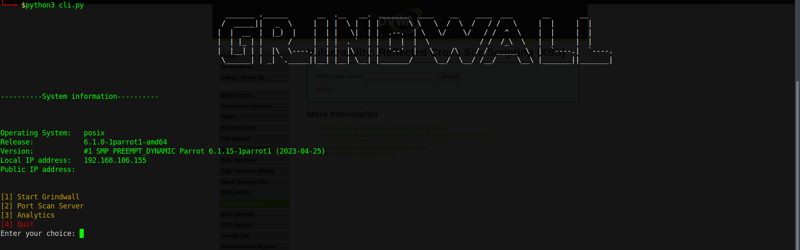
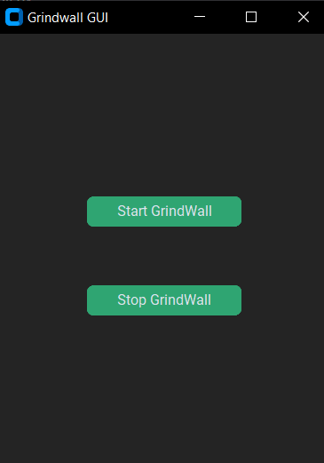
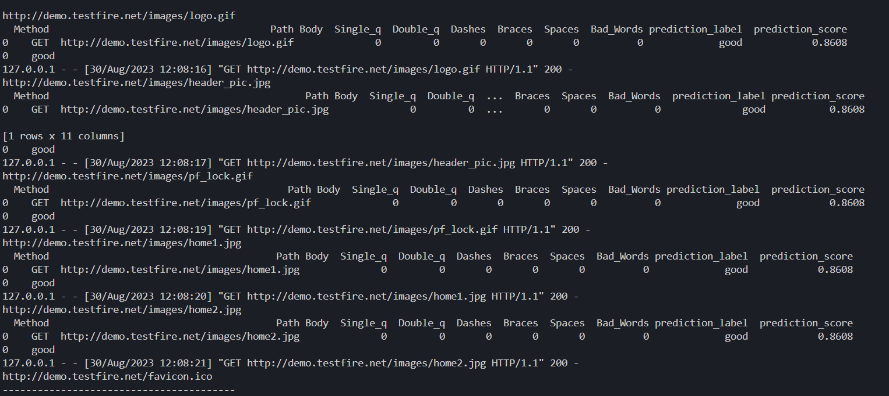
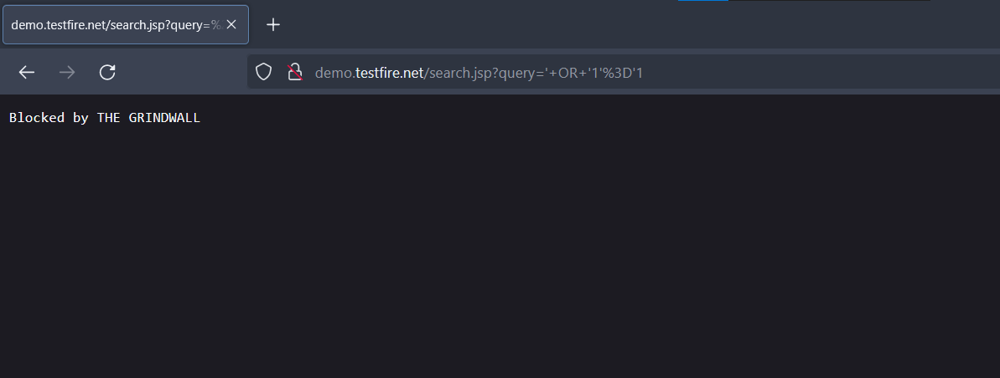
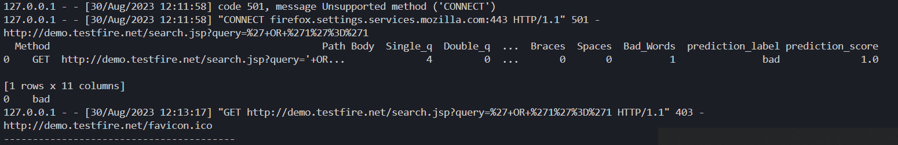

# GRINDWALL 

## ML based Firewall System

## Description:

<br>
Grindwall is an ML based Firewall System that uses a machine learning model to filter out bad or malicious requests to the server.
</br>
<br>
<li>Each model uses a specefic classification algorithm to determine the nature of incoming packets and classifies them on the basis of the vulnerability that the request tries to exploit.
</li>
<li>Bad Packets are dropped by the server and the client is displayed with a message.
</li>

## Contents:

<ol>
  <h3>Datasets</h3>
<li>full_xss_sqli_dataset.csv =  Dataset for training the model - Version 1
<li>version_4_full.csv - Full dataset for Version 4(includes cmdi)
<li>new_specs_dataset.csv - Dataset for classifying according to vulnerability.

  <h3>Scripts<h3>

<li>network_sec.ipynb = Notebook file used for creating the model and other operations related to ML
<li>grindwall.py = Main Script used to setup the firewall
<li>requirements.txt = Python Requirements for running the script
<li>test.csv = Dataset used for testing the model
<li>gring_gui.py = Scipt to run Grindwall as GUI
  
  <h4>Models</h4>
  
<li>model1_grindwall.pkl  = The saved model checkpoint which is loaded into the script for use in the firewall, only filters sqli - Uses Random Forest Classifier
<li>model2_grindwall = The saved model Checkpoint, which filters sql injections and XSS payloads - Uses Ada Boost Classifier
<li>model3_grindwall = Saved Model checkpoint that filters on the basis of the vulnerability that the packet tries to exploit; "sqli","xss" or "good"- Uses Random Forest Classifier </li>
<li>model4_grindwall = Saved Model checkpoint that filters on the basis of the vulnerability that the packet tries to exploit; "sqli","xss","cmdi" or "good" - Uses Light Gradient Boosting Machine  Classification</li>
  <h3>Wordlists</h3>
<li>sqlInjection.txt = Wordlist containing payloads for SQL injection attacks used for dataset preparation
<li>xss_payloads.txt = Wordlist containing XSS payloads
<li>cmdi_payloads.txt = Wordlist containing cmdi payloads

</ol>


## Installation And Working


* Clone this Repo
Install the requirements using the command 
 ```python
 pip install -r requirements.txt  
 ```
* Once dependencies are installed run 

```python 
python cli.py
```


<li>Alternatively you can also run the GUI version of Grindwall using :

```python
python gring_gui.py
```


<br></br><br></br>
<li> Once the firewall is up and running configure your browser or computer to utilize proxy server running on port 1234 ( You can change this setting in grindwall.py file). <br>
You can  use windows proxy settings by accessing <br>
Settings > Network And Internet > Proxy > Enable proxy with 
<br><br>
Address - 127.0.0.1
<br>Port - 1234
<br><br>
Or you can use extensions like <a href="https://chrome.google.com/webstore/detail/foxyproxy-standard/gcknhkkoolaabfmlnjonogaaifnjlfnp">Foxy Proxy</a> to use a proxy server for just your browser.

<li>Once your browser is configured to listen using the proxy server, all your requests pass through the ML model, which determines if your request is malicious or not and alerts you by dropping the packet.

<li> You can view all the outgoing requests in the terminal and log file.
<br><br>

<br>
<li>Any malicious requests will be returned with the 'bad' classification and the following message will be displayed.
<br>

</br><br>
<li>The terminal log displays the prediction label according to the vulnerability
<br></br>


## Future Implementations:

### Support for other Web Vulnerabilities Including 

<li> Cross Site Scripting = Completed
<li> Command Injections = Completed
<li> Support For HTTPS connections
<li> Comprehensive GUI
<li>Analytics


