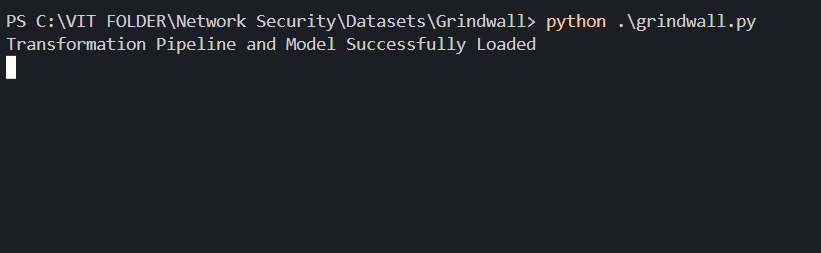

# GRINDWALL 

## ML based Firewall System

## Description:

<br>
Grindwall is an ML based Firewall System that uses a machine learning model to filter out bad or malicious requests to the server.
</br>
<br>
<li>It uses Random Forest Classification model to determine the nature of incoming packets and classifies them as 'good' or 'bad' packets.
</li>
<li>Bad Packets are dropped by the server and the client is displayed with a message.
</li>

## Contents:

<ol>
<li>main1.csv =  Dataset for training the model
<li>model1_grindwall.pkl  = The saved model checkpoint which is loaded into the script for use in the firewall
<li>network_sec.ipynb = Notebook file used for creating the model and other operations related to ML
<li>grindwall.py = Main Script used to setup the firewall
<li>requirements.txt = Python Requirements for running the script
<li>sqlInjection.txt = Wordlist containing payloads for SQL injection attacks used for dataset preparation
<li>test.csv = Dataset used for testing the model


</ol>


## Installation And Working

<li>
Clone this Repo
<li>Install the requirements using the command <br>
``` pip install -r requirements.txt ``` 
</br>
<li>Once dependencies are installed run 
<br>
```python grindwall.py```
</br>
<br>

<br>
<li> Once the firewall is up and running configure your browser or computer to utilize proxy server running on port 1234 ( You can change this setting in grindwall.py file). <br>
You can  use windows proxy settings by accessing <br>
Settings > Network And Internet > Proxy > Enable proxy with 
<br><br>
Address - 127.0.0.1
<br>Port - 1234
<br><br>
Or you can use extensions like <a href="https://chrome.google.com/webstore/detail/foxyproxy-standard/gcknhkkoolaabfmlnjonogaaifnjlfnp">Foxy Proxy</a> to use a proxy server for just your browser.

<li>Once your browser is configured to listen using the proxy server, all your requests pass through the ML model, which determines if your request is malicious or not and alerts you by dropping the packet.

<li> You can view all the outgoing requests in the terminal and log file.
<br><br>

<br>
<li>Any malicious requests will be returned with the 'bad' classification and the following message will be displayed.
<br>

</br><br>
<li>The terminal log displays the prediction label as 'bad'
<br></br>


## Future Implementations:

### Support for other Web Vulnerabilities Including 

<li> Cross Site Scripting
<li> File Inclusion
<li> Command Injections
<li> Support For HTTPS connections


